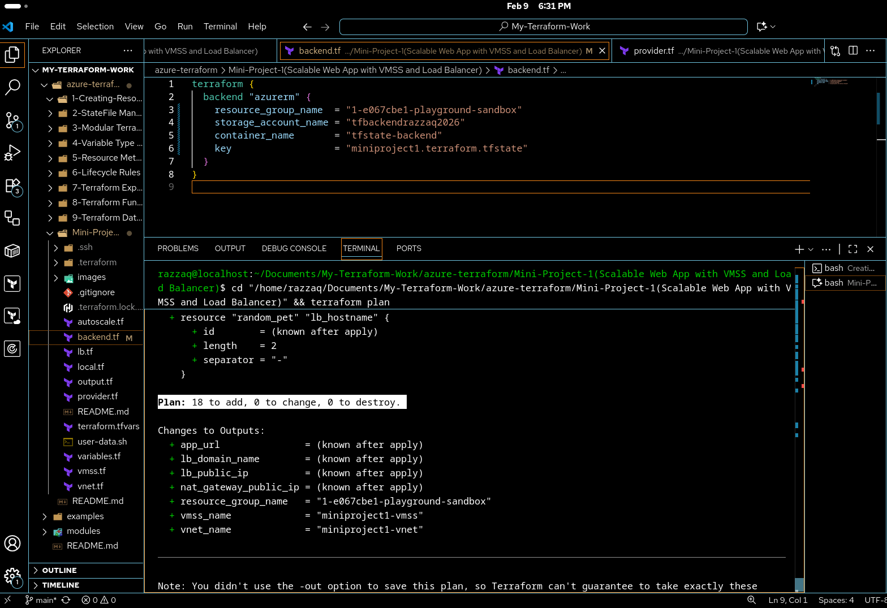
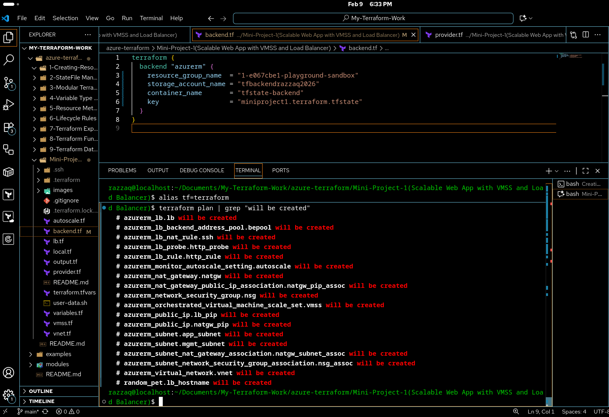
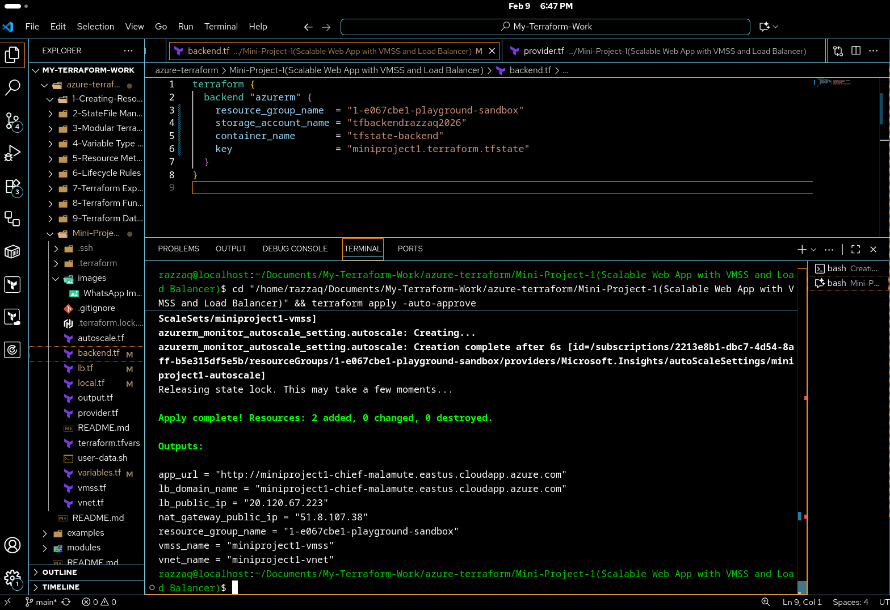
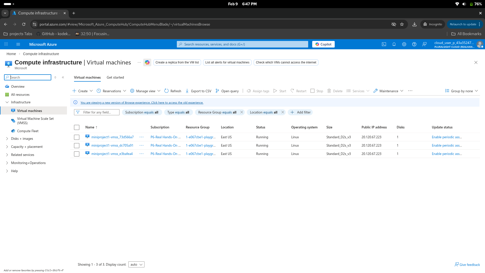
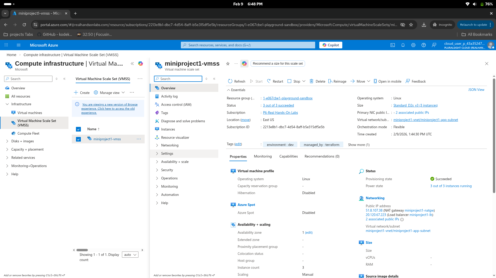
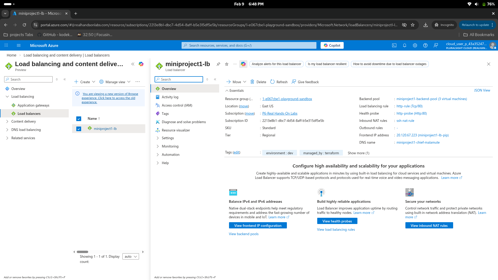
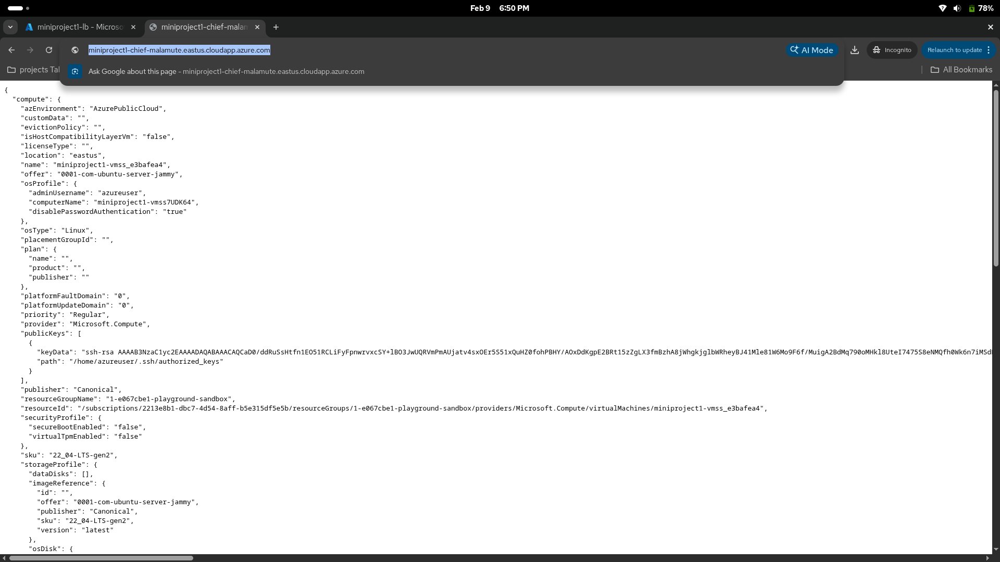

<div align="center">


# 🚀 Mini Project 1

### Scalable Web App with VMSS and Load Balancer

<br/>


<br/>


</div>

<br/>

---

<details>
<summary><b>⚠️ Playground Limitations (click to expand)</b></summary>

<br/>

This project was built using a **Cloud Playground (sandbox)** with **limited privileges**. The sandbox does **not** allow creating Resource Groups, registering Resource Providers, or creating Service Principals. Because of these restrictions, certain workarounds were applied across the Terraform files.

### What Was Changed and Why

| File | What Changed | Why |
|:---|:---|:---|
| `provider.tf` | `subscription_id` is explicitly set | The sandbox requires specifying the subscription ID manually |
| `provider.tf` | `resource_provider_registrations = "none"` | The sandbox does not allow registering Azure Resource Providers |
| `vnet.tf` | Uses `data "azurerm_resource_group"` (data source) instead of `resource "azurerm_resource_group"` | The sandbox does not allow creating new Resource Groups, so we reference the pre existing one |
| `lb.tf` | All references use `data.azurerm_resource_group.rg` | Same reason — referencing the pre existing Resource Group |
| `vmss.tf` | All references use `data.azurerm_resource_group.rg` | Same reason — referencing the pre existing Resource Group |
| `autoscale.tf` | All references use `data.azurerm_resource_group.rg` | Same reason — referencing the pre existing Resource Group |
| `output.tf` | Output references `data.azurerm_resource_group.rg.name` | Same reason — reading from data source instead of resource |
| `variables.tf` | Added `resource_group_name` variable | Needed to pass the pre existing Resource Group name |
| `terraform.tfvars` | Added `resource_group_name` value | Supplies the sandbox Resource Group name |

### If You Have a Personal Azure Account

If you are using a **personal Azure account** with full privileges, you can undo these workarounds:

1. **In `provider.tf`**: Remove `subscription_id` (Terraform will use your default) and remove `resource_provider_registrations = "none"` (Terraform will auto register providers)

2. **In `vnet.tf`**: Replace the data source with a resource block:
   ```hcl
   resource "azurerm_resource_group" "rg" {
     name     = "${var.prefix}-rg"
     location = var.location
     tags     = local.common_tags
   }
   ```

3. **In all files** (`vnet.tf`, `lb.tf`, `vmss.tf`, `autoscale.tf`, `output.tf`): Change every reference from:
   - `data.azurerm_resource_group.rg.name` → `azurerm_resource_group.rg.name`
   - `data.azurerm_resource_group.rg.location` → `azurerm_resource_group.rg.location`

4. **In `variables.tf` and `terraform.tfvars`**: Remove the `resource_group_name` variable and its value (Terraform will create the RG for you)

</details>

---

## 📌 Overview

> This mini project brings together multiple Terraform concepts learned throughout the course into a **single, real world deployment**.

It provisions a **scalable web application** on Azure using a **Virtual Machine Scale Set (VMSS)** behind an **Azure Load Balancer**, with **autoscaling** based on CPU utilization.

Every VM instance runs **Apache with PHP**, serving a metadata based status page that shows which instance is handling the request.

```
         ┌─────────────────────────────────────────────────────┐
         │               Incoming HTTP Traffic                 │
         └────────────────────────┬────────────────────────────┘
                                  │
                                  ▼
                    ┌─────────────────────────┐
                    │     Load Balancer        │
                    │   (Standard SKU)         │
                    └─────┬──────────┬────────┘
                          │          │
                    ┌─────▼──┐  ┌───▼─────┐
                    │  VM 1  │  │  VM 2   │  ◄── Auto Scaled
                    │ Apache │  │ Apache  │
                    └────────┘  └─────────┘
```

---

## 🏗️ Architecture

<div align="center">


</div>

---

## 🤔 Why This Architecture?

<table>
<tr>
<td width="50%">

### 🖥️ Why VMSS?

VMSS is designed for **automatically scaling identical VMs** based on demand

- ✅ Automatic instance creation and deletion based on rules
- ✅ Consistent configuration across all instances via a template
- ✅ Zone aware deployments for high availability
- ✅ Rolling updates without downtime

</td>
<td width="50%">

### ⚖️ Why Load Balancer?

The Azure Load Balancer **distributes traffic evenly** across healthy instances

- ✅ Health probes detect unhealthy instances and stop sending traffic
- ✅ Standard SKU provides zone redundancy and higher SLA
- ✅ NAT rules allow SSH access through unique ports

</td>
</tr>
<tr>
<td width="50%">

### 🌐 Why NAT Gateway?

The NAT Gateway provides a **consistent outbound IP** for all VMSS instances

- ✅ Without it, VMSS instances have **no default outbound internet**
- ✅ Ensures VMs can download packages and reach external APIs
- ✅ All outbound traffic exits through a single, predictable public IP

</td>
<td width="50%">

### 📈 Why Autoscaling?

Autoscaling ensures **cost efficiency and performance**

- ✅ Scale out (add VMs) when CPU exceeds **80%**
- ✅ Scale in (remove VMs) when CPU drops below **10%**
- ✅ Cooldown periods prevent rapid scaling oscillations

</td>
</tr>
</table>

---

## 🛠️ What This Project Deploys

<div align="center">

| # | Resource | Purpose |
|:---:|:---|:---|
| 1 | **Resource Group** | Container for all resources |
| 2 | **Virtual Network** | Isolated network `10.0.0.0/16` |
| 3 | **App Subnet** | Subnet for VMSS instances `10.0.0.0/20` |
| 4 | **Management Subnet** | Reserved subnet for future bastion/jumpbox `10.0.16.0/20` |
| 5 | **Network Security Group** | Firewall rules: allow HTTP (80), HTTPS (443), SSH (22) |
| 6 | **Public IP (LB)** | Static IP with DNS label for Load Balancer |
| 7 | **Load Balancer** | Distributes HTTP traffic across VMSS instances |
| 8 | **Backend Pool** | Group of VMSS instances receiving traffic |
| 9 | **Health Probe** | Checks instance health on port 80 |
| 10 | **LB Rule** | Routes port 80 traffic to backend pool |
| 11 | **NAT Rule** | Maps ports 50000 50119 to SSH (22) on backend VMs |
| 12 | **NAT Gateway** | Provides outbound internet for VMSS instances |
| 13 | **Public IP (NAT)** | Static IP for NAT Gateway outbound traffic |
| 14 | **VMSS** | Orchestrated scale set running Ubuntu 22.04 with Apache |
| 15 | **Autoscale Setting** | CPU based rules (scale out > 80%, scale in < 10%) |

</div>

---

## 📁 File Structure

```bash
📦 Mini-Project-1(Scalable Web App with VMSS and Load Balancer)/
 ┣ 📄 provider.tf         # Provider configuration (AzureRM + Random)
 ┣ 📄 backend.tf          # Remote state configuration
 ┣ 📄 variables.tf        # All input variables with validations
 ┣ 📄 terraform.tfvars    # Variable values
 ┣ 📄 local.tf            # Local values (tags, VM size lookup, NSG rules)
 ┣ 📄 vnet.tf             # VNET, subnets, NSG, and associations
 ┣ 📄 lb.tf               # Load Balancer, rules, probe, and NAT
 ┣ 📄 vmss.tf             # NAT Gateway and VMSS configuration
 ┣ 📄 autoscale.tf        # Autoscale settings and rules
 ┣ 📄 user-data.sh        # Bootstrap script for Apache + PHP
 ┣ 📄 output.tf           # Deployment outputs
 ┣ 📄 .gitignore          # Ignore Terraform state and SSH keys
 ┗ 📄 README.md           # This file
```

---

## 🔧 Terraform Concepts Used

> This mini project integrates concepts from previous lessons into one cohesive deployment.

| Concept | Where Used | Lesson |
|:---|:---|:---:|
| **Modular File Structure** | Separate .tf files for each logical group | 3 |
| **Variable Validations** | Environment restricted to dev/staging/prod, location restricted | 4 |
| **Local Values** | Common tags, VM size lookup, NSG rules map | 4 |
| **Dynamic Blocks** | NSG security rules generated from map | 7 |
| **Lookup Function** | VM size selected based on environment | 8 |
| **Lifecycle Rules** | `ignore_changes = [instances]` on VMSS (autoscaler manages count) | 6 |
| **Random Provider** | `random_pet` for unique DNS labels | 8 |
| **User Data** | `base64encode(file())` to bootstrap VMs with Apache | — |
| **Data Sources** | Reference existing Resource Group | 9 |
| **Multiple Resource Types** | 15+ Azure resources working together | — |

---

## 🚀 How to Deploy

### Prerequisites

| Requirement | Version |
|:---|:---|
| Azure CLI | Authenticated (`az login`) |
| Terraform | >= 1.9.0 |
| SSH Key Pair | RSA 4096 bit |

### Step 1 — Generate SSH Keys

```bash
mkdir -p .ssh
ssh-keygen -t rsa -b 4096 -f .ssh/key -N ""
```

### Step 2 — Initialize and Deploy

```bash
terraform init
terraform plan
terraform apply
```

### Step 3 — Access the Application

```bash
# Get the application URL
terraform output app_url

# Get the Load Balancer public IP
terraform output lb_public_ip

# SSH into a specific VM instance (via NAT rule)
ssh -i .ssh/key -p 50000 azureuser@<LB_PUBLIC_IP>
```

### Step 4 — Clean Up

```bash
terraform destroy
```

---

## 📸 Screenshots

<details open>
<summary><b>🖼️ Hands On Lab Activity</b></summary>

<br/>

<div align="center">



<br/><br/>



<br/><br/>



<br/><br/>



<br/><br/>



<br/><br/>



<br/><br/>



</div>

</details>

---

## 📚 References

<details open>
<summary><b>📖 HashiCorp Documentation</b></summary>

<br/>

| Resource | Link |
|:---|:---|
| Terraform AzureRM Provider | [Registry Docs](https://registry.terraform.io/providers/hashicorp/azurerm/latest/docs) |
| azurerm_orchestrated_virtual_machine_scale_set | [Registry Docs](https://registry.terraform.io/providers/hashicorp/azurerm/latest/docs/resources/orchestrated_virtual_machine_scale_set) |
| azurerm_lb | [Registry Docs](https://registry.terraform.io/providers/hashicorp/azurerm/latest/docs/resources/lb) |
| azurerm_lb_rule | [Registry Docs](https://registry.terraform.io/providers/hashicorp/azurerm/latest/docs/resources/lb_rule) |
| azurerm_lb_probe | [Registry Docs](https://registry.terraform.io/providers/hashicorp/azurerm/latest/docs/resources/lb_probe) |
| azurerm_lb_nat_rule | [Registry Docs](https://registry.terraform.io/providers/hashicorp/azurerm/latest/docs/resources/lb_nat_rule) |
| azurerm_monitor_autoscale_setting | [Registry Docs](https://registry.terraform.io/providers/hashicorp/azurerm/latest/docs/resources/monitor_autoscale_setting) |
| azurerm_nat_gateway | [Registry Docs](https://registry.terraform.io/providers/hashicorp/azurerm/latest/docs/resources/nat_gateway) |
| random_pet | [Registry Docs](https://registry.terraform.io/providers/hashicorp/random/latest/docs/resources/pet) |
| Dynamic Blocks | [HashiCorp Docs](https://developer.hashicorp.com/terraform/language/expressions/dynamic-blocks) |
| Lifecycle Meta Argument | [HashiCorp Docs](https://developer.hashicorp.com/terraform/language/meta-arguments/lifecycle) |

</details>

<details open>
<summary><b>☁️ Microsoft Azure Documentation</b></summary>

<br/>

| Resource | Link |
|:---|:---|
| Virtual Machine Scale Sets | [Azure Docs](https://learn.microsoft.com/en-us/azure/virtual-machine-scale-sets/overview) |
| Azure Load Balancer | [Azure Docs](https://learn.microsoft.com/en-us/azure/load-balancer/load-balancer-overview) |
| Autoscale Settings | [Azure Docs](https://learn.microsoft.com/en-us/azure/azure-monitor/autoscale/autoscale-overview) |
| NAT Gateway | [Azure Docs](https://learn.microsoft.com/en-us/azure/nat-gateway/nat-overview) |
| Virtual Network | [Azure Docs](https://learn.microsoft.com/en-us/azure/virtual-network/virtual-networks-overview) |
| Network Security Groups | [Azure Docs](https://learn.microsoft.com/en-us/azure/virtual-network/network-security-groups-overview) |

</details>

---

<div align="center">


<br/><br/>

**⭐ Star this repo if you found it helpful!**

</div>
