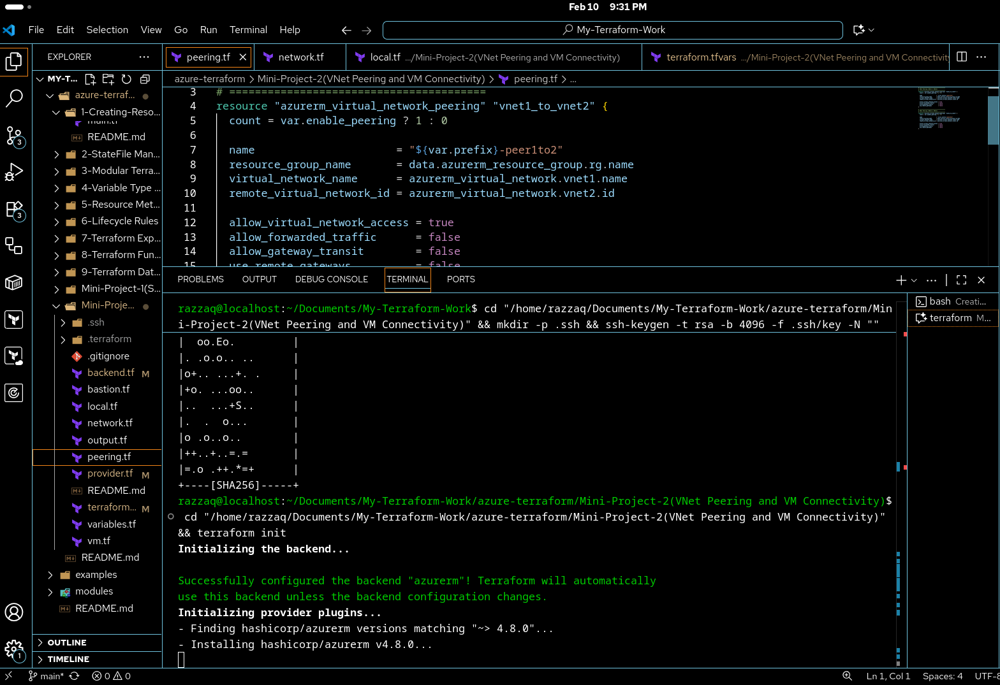
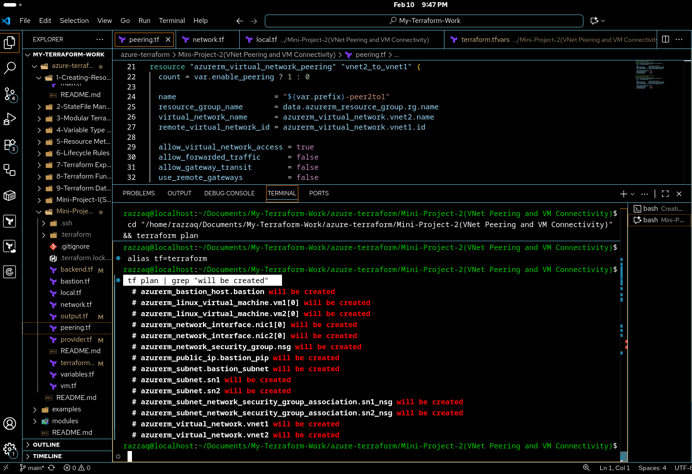
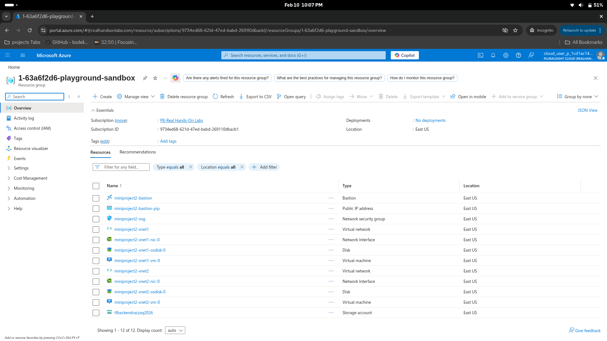
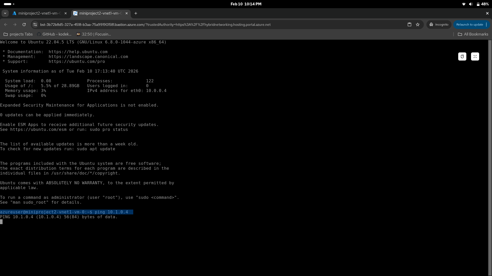
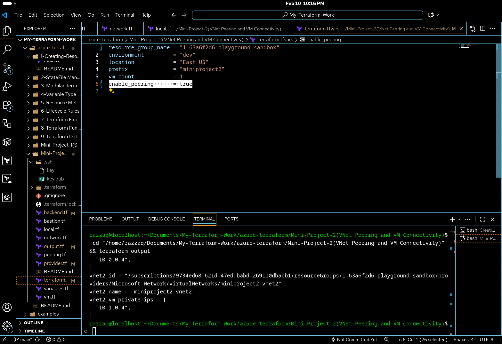
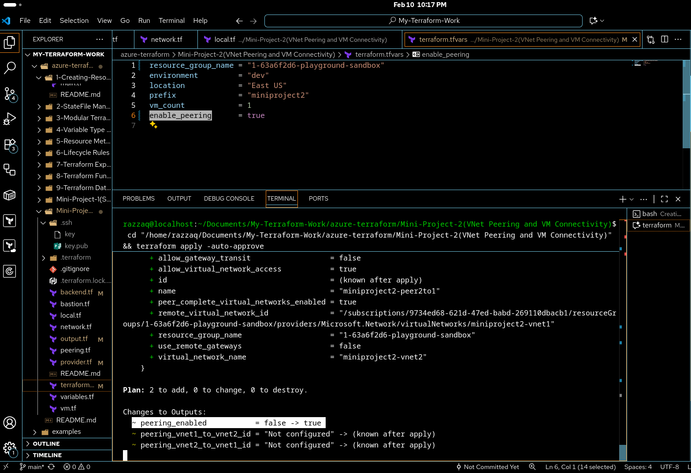
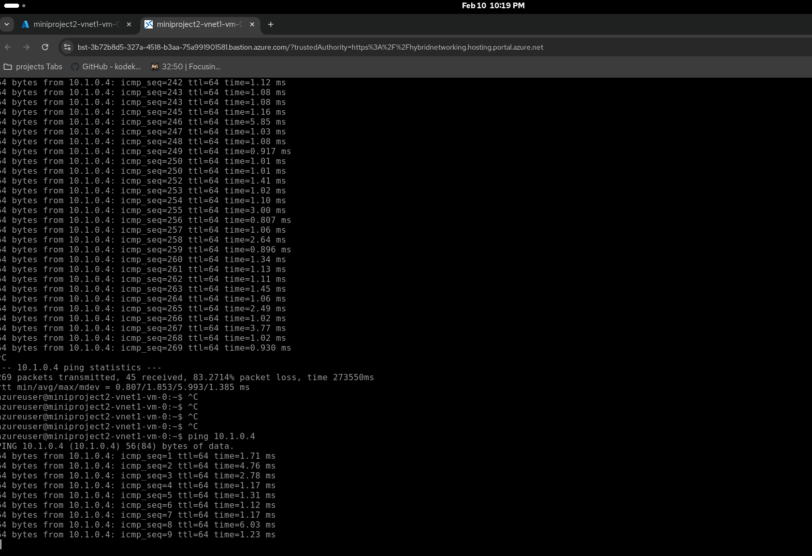

<div align="center">


# 🔗 Mini Project 2

### VNet Peering and VM Connectivity

<br/>


<br/>


</div>

<br/>

---

<details>
<summary><b>⚠️ Playground Limitations (click to expand)</b></summary>

<br/>

This project was built using a **Cloud Playground (sandbox)** with **limited privileges**. The sandbox does **not** allow creating Resource Groups, registering Resource Providers, or creating Service Principals. Because of these restrictions, certain workarounds were applied across the Terraform files.

### What Was Changed and Why

| File | What Changed | Why |
|:---|:---|:---|
| `provider.tf` | `subscription_id` is explicitly set | The sandbox requires specifying the subscription ID manually |
| `provider.tf` | `resource_provider_registrations = "none"` | The sandbox does not allow registering Azure Resource Providers |
| `network.tf` | Uses `data "azurerm_resource_group"` (data source) instead of `resource "azurerm_resource_group"` | The sandbox does not allow creating new Resource Groups, so we reference the pre existing one |
| `bastion.tf` | All references use `data.azurerm_resource_group.rg` | Same reason — referencing the pre existing Resource Group |
| `vm.tf` | All references use `data.azurerm_resource_group.rg` | Same reason — referencing the pre existing Resource Group |
| `peering.tf` | All references use `data.azurerm_resource_group.rg` | Same reason — referencing the pre existing Resource Group |
| `output.tf` | Output references `data.azurerm_resource_group.rg.name` | Same reason — reading from data source instead of resource |
| `variables.tf` | Added `resource_group_name` variable | Needed to pass the pre existing Resource Group name |
| `terraform.tfvars` | Added `resource_group_name` value | Supplies the sandbox Resource Group name |

### If You Have a Personal Azure Account

If you are using a **personal Azure account** with full privileges, you can undo these workarounds:

1. **In `provider.tf`**: Remove `subscription_id` (Terraform will use your default) and remove `resource_provider_registrations = "none"` (Terraform will auto register providers)

2. **In `network.tf`**: Replace the data source with a resource block:
   ```hcl
   resource "azurerm_resource_group" "rg" {
     name     = "${var.prefix}-rg"
     location = var.location
     tags     = local.common_tags
   }
   ```

3. **In all files** (`network.tf`, `bastion.tf`, `vm.tf`, `peering.tf`, `output.tf`): Change every reference from:
   - `data.azurerm_resource_group.rg.name` → `azurerm_resource_group.rg.name`
   - `data.azurerm_resource_group.rg.location` → `azurerm_resource_group.rg.location`

4. **In `variables.tf` and `terraform.tfvars`**: Remove the `resource_group_name` variable and its value (Terraform will create the RG for you)

</details>

---

## 📌 Overview

> This mini project demonstrates **Azure VNet Peering** — connecting two isolated Virtual Networks to allow private communication between VMs without routing traffic over the public internet.

The project deploys **two separate VNets**, each with its own **subnet and VM**, plus an **Azure Bastion Host** for secure SSH access. You first test connectivity **without peering** (ping fails), then enable peering and test again (ping succeeds).

---

## 🏗️ Architecture

<div align="center">


</div>

---

## 🤔 Why This Architecture?

<table>
<tr>
<td width="50%">

### 🔗 Why VNet Peering?

VNet Peering provides **low latency, high bandwidth** private connectivity between VNets

- ✅ Traffic stays on the Microsoft backbone (never hits the public internet)
- ✅ Works across subscriptions and even across regions (global peering)
- ✅ No gateways, no extra hops, no encryption overhead
- ✅ Simple to set up with bidirectional peering

</td>
<td width="50%">

### 🏰 Why Bastion Host?

Azure Bastion provides **secure SSH/RDP** access to VMs without exposing public IPs

- ✅ No need for public IPs on individual VMs
- ✅ SSH over TLS directly through the Azure portal
- ✅ Protection against port scanning and brute force attacks
- ✅ No need to manage NSG rules for remote access

</td>
</tr>
<tr>
<td width="50%">

### 🖥️ Why count and count.index?

Using `count` demonstrates **scalable VM provisioning**

- ✅ Deploy multiple VMs from a single resource block
- ✅ `count.index` gives each VM a unique name and disk
- ✅ Easy to scale up by changing one variable
- ✅ Demonstrates a key Terraform meta argument

</td>
<td width="50%">

### 🧪 Why Test Before and After?

Testing connectivity in both states proves that peering actually works

- ❌ **Without peering**: `ping` from VM1 to VM2 fails (isolated VNets)
- ✅ **With peering**: `ping` from VM1 to VM2 succeeds (peered VNets)
- ✅ Demonstrates the real world impact of VNet peering
- ✅ Uses a boolean variable to toggle peering on/off

</td>
</tr>
</table>

---

## 🛠️ What This Project Deploys

<div align="center">

| # | Resource | Purpose |
|:---:|:---|:---|
| 1 | **Resource Group** | Container for all resources |
| 2 | **VNet 1** | First isolated network `10.0.0.0/16` |
| 3 | **Subnet 1** | Subnet for VMs in VNet 1 `10.0.0.0/24` |
| 4 | **VNet 2** | Second isolated network `10.1.0.0/16` |
| 5 | **Subnet 2** | Subnet for VMs in VNet 2 `10.1.0.0/24` |
| 6 | **AzureBastionSubnet** | Required subnet for Bastion Host `10.0.1.0/26` |
| 7 | **Network Security Group** | Allows SSH (22) and ICMP (ping) traffic |
| 8 | **NSG Associations** | Attaches NSG to both subnets |
| 9 | **Bastion Public IP** | Static Standard SKU IP for Bastion |
| 10 | **Azure Bastion Host** | Secure SSH access to VMs without public IPs |
| 11 | **NIC (VNet 1)** | Network interface for VM in VNet 1 |
| 12 | **NIC (VNet 2)** | Network interface for VM in VNet 2 |
| 13 | **VM 1 (VNet 1)** | Ubuntu 22.04 VM in VNet 1 |
| 14 | **VM 2 (VNet 2)** | Ubuntu 22.04 VM in VNet 2 |
| 15 | **VNet Peering (1→2)** | Peering from VNet 1 to VNet 2 (conditional) |
| 16 | **VNet Peering (2→1)** | Peering from VNet 2 to VNet 1 (conditional) |

</div>

---

## 📁 File Structure

```bash
📦 Mini-Project-2(VNet Peering and VM Connectivity)/
 ┣ 📄 provider.tf         # Provider configuration (AzureRM)
 ┣ 📄 backend.tf          # Remote state configuration
 ┣ 📄 variables.tf        # All input variables with validations
 ┣ 📄 terraform.tfvars    # Variable values
 ┣ 📄 local.tf            # Local values (common tags)
 ┣ 📄 network.tf          # VNets, subnets, NSG, and associations
 ┣ 📄 bastion.tf          # Azure Bastion Host and its public IP
 ┣ 📄 vm.tf               # VMs and NICs using count
 ┣ 📄 peering.tf          # Conditional VNet peering (toggled by variable)
 ┣ 📄 output.tf           # Deployment outputs
 ┣ 📄 .gitignore          # Ignore Terraform state and SSH keys
 ┗ 📄 README.md           # This file
```

---

## 🔧 Terraform Concepts Used

> This mini project integrates concepts from previous lessons into a networking focused deployment.

| Concept | Where Used | Lesson |
|:---|:---|:---:|
| **Modular File Structure** | Separate .tf files for network, VMs, bastion, peering | 3 |
| **Variable Validations** | Environment restricted to dev/staging/prod, location restricted | 4 |
| **Local Values** | Common tags applied to all resources | 4 |
| **count Meta Argument** | VMs and NICs created using `count` and `count.index` | 5 |
| **Conditional Expressions** | `count = var.enable_peering ? 1 : 0` to toggle peering | 7 |
| **Data Sources** | Reference existing Resource Group | 9 |
| **Splat Expressions** | `azurerm_network_interface.nic1[*].private_ip_address` in outputs | 7 |
| **merge Function** | `merge(local.common_tags, { role = "vnet1-vm" })` for VM tags | 8 |

---

## 🚀 How to Deploy

### Prerequisites

| Requirement | Version |
|:---|:---|
| Azure CLI | Authenticated (`az login`) |
| Terraform | >= 1.9.0 |
| SSH Key Pair | RSA 4096 bit |

### Step 1 — Generate SSH Keys

```bash
mkdir -p .ssh
ssh-keygen -t rsa -b 4096 -f .ssh/key -N ""
```

### Step 2 — Deploy Without Peering

```bash
terraform init
terraform plan
terraform apply
```

### Step 3 — Test Connectivity (Should Fail)

1. Go to the **Azure Portal** → **Bastion**
2. Connect to **VM 1** via Bastion
3. Try to ping **VM 2**:

```bash
ping <VM2_PRIVATE_IP>
# ❌ This will FAIL — VNets are isolated
```

### Step 4 — Enable Peering

Update `terraform.tfvars`:

```hcl
enable_peering = true
```

Then apply:

```bash
terraform plan
terraform apply
```

### Step 5 — Test Connectivity Again (Should Succeed)

1. Connect to **VM 1** via Bastion
2. Ping **VM 2** again:

```bash
ping <VM2_PRIVATE_IP>
# ✅ This will SUCCEED — VNets are now peered
```

### Step 6 — Clean Up

```bash
terraform destroy
```

---

## 📸 Screenshots

<details open>
<summary><b>🖼️ Hands On Lab Activity</b></summary>

<br/>

<div align="center">



<br/><br/>



<br/><br/>



<br/><br/>



<br/><br/>



<br/><br/>



<br/><br/>



</div>

</details>

---

## 📚 References

<details open>
<summary><b>📖 HashiCorp Documentation</b></summary>

<br/>

| Resource | Link |
|:---|:---|
| Terraform AzureRM Provider | [Registry Docs](https://registry.terraform.io/providers/hashicorp/azurerm/latest/docs) |
| azurerm_virtual_network | [Registry Docs](https://registry.terraform.io/providers/hashicorp/azurerm/latest/docs/resources/virtual_network) |
| azurerm_subnet | [Registry Docs](https://registry.terraform.io/providers/hashicorp/azurerm/latest/docs/resources/subnet) |
| azurerm_virtual_network_peering | [Registry Docs](https://registry.terraform.io/providers/hashicorp/azurerm/latest/docs/resources/virtual_network_peering) |
| azurerm_linux_virtual_machine | [Registry Docs](https://registry.terraform.io/providers/hashicorp/azurerm/latest/docs/resources/linux_virtual_machine) |
| azurerm_bastion_host | [Registry Docs](https://registry.terraform.io/providers/hashicorp/azurerm/latest/docs/resources/bastion_host) |
| azurerm_network_security_group | [Registry Docs](https://registry.terraform.io/providers/hashicorp/azurerm/latest/docs/resources/network_security_group) |
| count Meta Argument | [HashiCorp Docs](https://developer.hashicorp.com/terraform/language/meta-arguments/count) |
| Conditional Expressions | [HashiCorp Docs](https://developer.hashicorp.com/terraform/language/expressions/conditionals) |

</details>

<details open>
<summary><b>☁️ Microsoft Azure Documentation</b></summary>

<br/>

| Resource | Link |
|:---|:---|
| Virtual Network Peering | [Azure Docs](https://learn.microsoft.com/en-us/azure/virtual-network/virtual-network-peering-overview) |
| Azure Bastion | [Azure Docs](https://learn.microsoft.com/en-us/azure/bastion/bastion-overview) |
| Virtual Machines | [Azure Docs](https://learn.microsoft.com/en-us/azure/virtual-machines/overview) |
| Virtual Network | [Azure Docs](https://learn.microsoft.com/en-us/azure/virtual-network/virtual-networks-overview) |
| Network Security Groups | [Azure Docs](https://learn.microsoft.com/en-us/azure/virtual-network/network-security-groups-overview) |

</details>

---

<div align="center">


<br/><br/>

**⭐ Star this repo if you found it helpful!**

</div>
